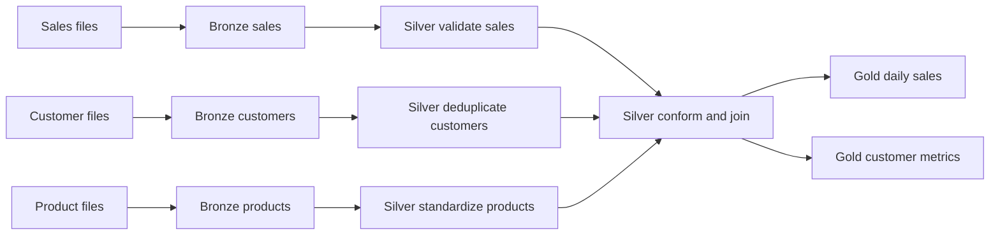
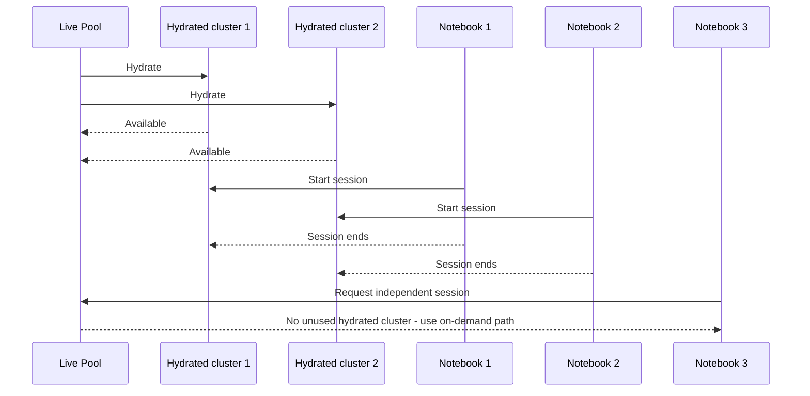
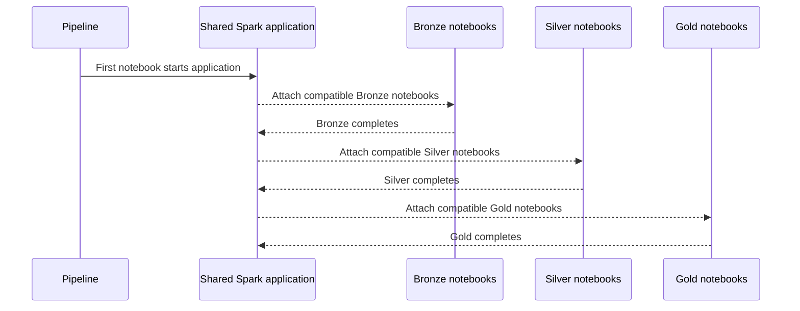
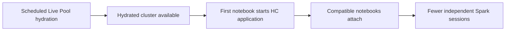

> **Benchmark status:** The article includes the first core S-A-B-C-D measurements. The sample contains two successful runs per scenario, so use the results as directional evidence and repeat the protocol under representative production conditions.

## Motivation: answering the Spark cost-performance question

Customers frequently ask me a deceptively simple question: **What is the most cost-effective Spark setup that still meets my pipeline performance target?**

It is a question I encounter often in my work at Microsoft, particularly when teams move production extract, transform, and load (ETL) processes into a medallion architecture on Microsoft Fabric. The answer is rarely "choose the biggest pool." For notebook-based pipelines, total duration and Capacity Unit (CU) consumption depend not only on how quickly transformations execute, but also on how many Spark sessions the pipeline creates, how long those sessions remain active, and whether compute is ready when the pipeline arrives.

Two Fabric capabilities address different parts of that problem:

- **Custom Live Pools** prepare clusters before a predictable workload window, reducing session provisioning latency.
- **High Concurrency** lets compatible notebooks share a running Spark application, reducing the number of independent sessions.

Used together, they can provide both a fast first session and fast attachment for subsequent notebook activities. But that does not mean enabling both is always the lowest-cost choice. A Live Pool can consume capacity while its clusters are hydrated, even when no notebook is executing, and too many notebooks sharing one session can compete for the same executors.

This article explains the mechanics, proposes a reproducible Bronze-Silver-Gold benchmark, and provides a decision framework for choosing the right configuration.

## The scenario: a notebook-based medallion pipeline

Consider a daily retail pipeline that processes a fixed input snapshot through three layers:



The Fabric pipeline contains:

| Layer | Notebook activities | Pattern |
| --- | ---: | --- |
| Bronze | 3 | Parallel ingestion into Delta tables |
| Silver | 4 | Three parallel cleansing activities followed by a join |
| Gold | 2 | Parallel business aggregations |

All activities run under the same pipeline identity, in the same workspace, with the same Fabric environment, Spark compute settings, libraries, and default lakehouse. Those controls are important because High Concurrency sharing requires compatible sessions.

The optimization target is not simply the fastest notebook. It is:

1. Meet the end-to-end pipeline service-level objective.
2. Minimize CU consumption required to meet it.
3. Keep startup behavior predictable during the production window.
4. Preserve enough isolation and executor capacity for transformations to run reliably.

## Custom Live Pools: prepare compute before the pipeline arrives

A Custom Live Pool is a set of prehydrated clusters associated with a custom Spark pool and a Fabric environment. During a configured schedule window, Fabric prepares the clusters, including the environment configuration, before a notebook requests a session. When a compatible hydrated cluster is available, a notebook session can start in approximately 5 to 10 seconds rather than waiting for standard on-demand provisioning. ([source][live-overview])

Custom Live Pools are most relevant when a Starter Pool cannot deliver its usual fast-start path and must provision compute. Typical examples include workspaces that use managed private endpoints (MPEs), custom libraries, custom Spark properties, or other settings that require session personalization or dedicated provisioning. If the default Starter Pool already starts the workload consistently in seconds, a Live Pool may add operational complexity without a meaningful latency benefit.

Custom Live Pools require a paid Fabric capacity, a custom Spark pool, a published environment, and workspace Admin permissions. Trial capacities are not supported. During preview, Live Pool configuration is performed in the Fabric portal. API support for Live Pool configuration is planned for General Availability, enabling automation and CI/CD scenarios when the feature reaches GA. ([overview][live-overview], [configuration guide][live-config])

The lifecycle has four useful concepts:

- **Schedule window:** The period during which Fabric can keep clusters hydrated and rehydrate deactivated capacity.
- **Hydration:** Provisioning the cluster and applying the published environment so that it is ready for a notebook.
- **Idle deactivation:** Removing an unused hydrated cluster after the configured idle timeout.
- **Reactivation:** Rehydrating capacity during the active schedule according to the configured interval.

Outside the schedule window, notebooks fall back to standard Spark provisioning and do not receive the Live Pool warm-start benefit. ([source][live-config])

### Why the environment publishing mode matters

For the most predictable startup, use a published environment with libraries in **Full mode**. The library snapshot is baked into the hydrated cluster. With **Quick mode**, libraries install when the session starts, so a Live Pool can remove cluster-acquisition time without removing library-installation time. ([source][live-overview])

### Availability is finite

The configured maximum cluster count is a hard ceiling; the Live Pool does not scale beyond it. If all compatible hydrated clusters are busy, additional notebooks use on-demand provisioning, which can take approximately 3 to 5 minutes or longer depending on library dependencies. ([source][live-overview])

The Fabric product team has confirmed an additional planning rule:

> A Live Pool hydrated cluster is single-use for one Spark session within a Live Pool schedule/reactivation cycle.

This is current product behavior, not a conclusion inferred from the benchmark in this article. It means I would not size the pool only from the maximum number of simultaneously running notebooks. For independent, non-High-Concurrency sessions, I would also consider how many session starts are expected before the next successful reactivation.

For example, if a cycle begins with two available hydrated clusters and three independent sessions start sequentially, the first two can hit warm capacity while the third can take the on-demand path, even if the first session has already ended.



### The cost trade-off

Billing stops when the Spark session stops and its cluster is deallocated, or when idle deactivation removes an unused hydrated cluster. The schedule defines when Fabric can hydrate and reactivate Live Pool capacity; reaching the end of a schedule is not, by itself, the billing event to use when reasoning about an active session.

Under the standard **provisioned Fabric capacity** model, using a Custom Live Pool does not change the price of the purchased capacity. It changes when and how much of that capacity is consumed, which can affect headroom, smoothing, throttling, and the ability of other workloads to run. With **Autoscale Billing for Spark**, the consumed CU time has a direct billing impact, so idle and session lifetime become an explicit monetary consideration. ([source][spark-billing])

In either model, configure the custom pool carefully. A Live Pool cluster uses the node size and scaling boundaries configured in that pool. Enabling autoscale and choosing realistic minimum and maximum nodes can reduce CU consumption compared with keeping an oversized fixed cluster allocated.

A Live Pool is therefore most attractive when it avoids a real provisioning delay and the workload window is predictable enough to justify prehydration.

## High Concurrency: reuse a Spark application instead of creating one per notebook

In standard mode, each notebook activity creates its own Spark session. In High Concurrency mode, compatible notebook workloads share one Spark application. Fabric creates a separate read-eval-print loop (REPL) core for each workload, providing execution-state isolation, and uses FAIR scheduling across REPL cores to reduce starvation risk. ([source][hc-overview])

For notebooks triggered by pipelines, Fabric automatically packs compatible notebook activities into active High Concurrency sessions. Omitting a session tag does not opt out: compatible untagged activities can still be grouped on a best-effort basis. A shared session tag makes the intended grouping explicit, while different tags create separate grouping boundaries. ([source][hc-pipelines])

To share, activities must:

- Run within the same user or execution-identity boundary.
- Use the same workspace.
- Use the same default lakehouse configuration.
- Use matching Spark compute settings.
- Use the same environment library packages.

If a condition differs, Fabric creates another Spark session. ([source][hc-pipelines])

The default sharing limit is five notebooks per High Concurrency session. Current documentation also describes an environment property, `spark.highConcurrency.max`, that can raise the limit to 50. ([source][hc-overview]) Do not increase density only because the setting exists: validate executor contention, memory pressure, and failure isolation under representative load.

### What High Concurrency improves

The first activity still needs a Spark application. The benefit appears when later compatible activities attach to it:



Fabric bills the initiating notebook or pipeline activity that starts the shared Spark application. Subsequent workloads sharing that application are not billed as separate sessions; Capacity Metrics attributes the shared-session usage to the initiating item. ([source][hc-overview])

This does **not** mean the attached notebooks consume no compute. It means their work runs inside, and is attributed to, the initiating shared application.

### Control the shared driver lifetime

For pipeline High Concurrency sessions, the Spark property `livy.rsc.repl.session.driver.idle.timeout` controls how long the shared driver remains alive without notebook activity. The default is two minutes.

That default can be too short when a non-Spark activity sits between notebooks. For example, if a stored procedure activity normally takes six minutes, the shared driver can expire before the next notebook arrives. Set the property to cover the expected gap with a reasonable buffer:

```text
livy.rsc.repl.session.driver.idle.timeout = 10m
```

A longer timeout improves the chance that later notebooks reuse the session, but it also keeps compute allocated longer. Tune it from the longest expected orchestration gap rather than setting an unnecessarily high value.

To minimize CU consumption after the final notebook, you can explicitly stop the shared Spark session:

```python
spark.stop()
```

Only do this in the last notebook after confirming that no other notebook is using the shared application and that no concurrent or subsequent activity is expected to attach to it. Stopping the application while another workload is running or waiting to reuse it will interrupt that workload or force a new session.

### What High Concurrency does not guarantee

High Concurrency reduces repeated session startup and can improve resource utilization. It does not guarantee that transformation code runs faster. Concurrent REPL cores share the application's executors, so CPU-heavy shuffles, memory-intensive joins, or simultaneous writes can increase contention.

Use session tags as an architecture boundary, not merely a packing mechanism. For the example pipeline, a reasonable starting point is:

| Session tag | Activities | Reason |
| --- | --- | --- |
| `retail-ingest` | Bronze notebooks | Similar I/O-heavy ingestion profile |
| `retail-curate` | Silver notebooks | Shared configuration, with resources sized for joins |
| `retail-serve` | Gold notebooks | Separate aggregation and publishing boundary |

One tag for the entire pipeline may minimize session creation, but separate tags can provide better resource and failure isolation. Benchmark both if the trade-off matters.

## How Custom Live Pools and High Concurrency work together

The two features optimize different lifecycle points:

| Capability | Primary optimization | Unit being reused or prepared |
| --- | --- | --- |
| Custom Live Pool | First-session acquisition | A prehydrated cluster |
| High Concurrency | Subsequent compatible session attachment | A running Spark application |

Together, the first notebook can acquire a prehydrated cluster, create a High Concurrency Spark application, and allow later compatible notebooks to attach to that application:



This interaction can be particularly valuable in medallion pipelines with many short notebook activities. Without High Concurrency, each activity can consume another hydrated cluster or fall back to on-demand provisioning. With High Concurrency, multiple activities can be served by one shared application, reducing pressure on the Live Pool cluster count.

However, the combination has two independent consumption levers:

- How long and how many Live Pool clusters remain allocated.
- How large and how long the shared Spark applications remain active.

Optimize both. Under provisioned capacity, this protects capacity headroom; under Autoscale Billing, it also reduces billed Spark consumption.

## Measured core benchmark

The core lab used a deliberately simple sequential pipeline:

```text
Bronze -> Silver -> Gold
```

Every run processed the same deterministic 20-million-row workload on an F32 provisioned capacity. S, A, and B used three separate Spark applications. C and D used one High Concurrency application, with Silver and Gold attaching to the session created by Bronze. D was right-sized to one hydrated cluster because it required one independent Spark application.

The table reports two successful runs per scenario. Included CU-seconds contain notebook `Notebook HC Pipeline Run` operations and Live Pool environment `Custom Pool Startup` and `Custom Pool Ready` operations. Pipeline orchestration `ActivityRun` CU is excluded.

| Scenario | Average pipeline time | Range | Spark applications | Average notebook CU-s | Average environment CU-s | Average included CU-s | Runtime versus S | CU versus S |
| --- | ---: | ---: | ---: | ---: | ---: | ---: | ---: | ---: |
| S - Starter, no HC | 710.44 s | 679.22-741.66 | 3 | 4,629.01 | 0.00 | **4,629.01** | Baseline | Baseline |
| A - On-demand, no HC | 735.71 s | 723.53-747.90 | 3 | 2,979.70 | 0.00 | **2,979.70** | 3.6% slower | 35.6% lower |
| B - Live Pool, no HC | 216.20 s | 209.99-222.40 | 3 | 7,214.36 | 521.33 | **7,735.70** | 69.6% faster | 67.1% higher |
| C - On-demand with HC | 391.04 s | 385.82-396.25 | 1 | 1,430.39 | 0.00 | **1,430.39** | 45.0% faster | 69.1% lower |
| D - Live Pool with HC | 192.60 s | 184.07-201.13 | 1 | 3,088.14 | 350.12 | **3,438.27** | 72.9% faster | 25.7% lower |

The complete run IDs, stage timings, hydration operation IDs, and CU-attribution method are published in the [benchmark results and raw measurements](/blog/custom-live-pools-high-concurrency-benchmark-results/).

Because this is a two-run sample, the numbers are directional rather than statistically conclusive. Repeat the same test matrix with production data layout, concurrency, and transformation complexity before making a final production decision.

## What the measurements show

### High Concurrency was the CU-efficiency winner

C reduced average duration by 45.0% and CU consumption by 69.1% relative to S. It paid the on-demand acquisition cost once, then reused the application for Silver and Gold. At 1,430.39 CU-seconds, it used less than half the CUs of every other option.

This is the strongest argument for testing High Concurrency before adding prehydrated capacity: session reuse can improve both runtime and capacity efficiency without maintaining a Live Pool.

### The right-sized combined option was fastest

D completed in 192.60 seconds on average, 72.9% faster than S and 50.7% faster than C. It combined a warm first acquisition with High Concurrency attachment for later stages.

That additional latency improvement was not free. D consumed about 2.40 times C's CUs. The business decision is therefore whether reducing the average pipeline from 391 seconds to 193 seconds is worth the additional capacity consumption.

### Live Pool without High Concurrency was fast but expensive

B reduced runtime by 69.6%, but it created three independent Spark applications. Their active periods and two-minute driver tails overlapped, increasing average consumption to 7,735.70 CU-seconds: 67.1% more than S and 2.25 times the right-sized D configuration.

This result illustrates why Live Pool sizing must follow the number of independent Spark applications, not merely the number of notebook activities. If compatible stages can share one application, High Concurrency reduces both session creation and hydrated-cluster demand.

### On-demand independent sessions did not improve latency

A consumed 35.6% fewer CUs than S but was 3.6% slower. For this workload, changing the acquisition path without reducing the three independent sessions did not improve end-to-end duration.

## Recommendations from the benchmark

### Start with High Concurrency for compatible notebook chains

For sequential Bronze-Silver-Gold activities with matching identity, workspace, lakehouse, environment, libraries, and compute, use one intentional session tag and validate that later stages attach to the initiating session. C provided the best capacity efficiency in this benchmark.

Do not leave isolation to chance when workspace-level pipeline High Concurrency is enabled. Compatible untagged notebooks can be packed on a best-effort basis. Use the same tag to request sharing and distinct tags to create explicit isolation boundaries.

### Add a Custom Live Pool when startup latency has business value

Choose D when the first notebook must start predictably and the additional CU consumption is justified by the service-level objective. The strongest cases are predictable production windows where Starter Pools trigger provisioning because of MPEs, custom libraries, Spark properties, or environment personalization.

If a roughly six-and-a-half-minute pipeline is acceptable, C is the better efficiency choice. If the target requires approximately three minutes, the right-sized combined configuration is justified by the measured latency improvement.

### Size hydrated clusters from independent applications

The product-confirmed single-use behavior makes this a direct sizing exercise:

```text
required hydrated clusters per cycle
  = expected independent Spark session starts
```

Apply High Concurrency grouping first, then size the Live Pool for the remaining independent applications. In this test, B required three independent applications while D required one. Configuring D with one hydrated cluster avoided keeping unnecessary clusters ready.

### Keep the Live Pool window and idle settings tight

Start hydration early enough to meet the service-level window and verify availability before submission, but avoid a broader schedule than the workload requires. Unused hydrated clusters consume capacity until idle deactivation removes them.

Set `livy.rsc.repl.session.driver.idle.timeout` from the longest expected gap between compatible notebook activities. The two-minute setting worked for this immediately sequential pipeline. Increase it only when intervening non-Spark activities require a longer reuse window.

### Measure notebook and environment CU together

Notebook-only metrics can make Live Pool configurations appear cheaper than they are. Include `Custom Pool Startup` and `Custom Pool Ready` environment operations, and exclude unrelated pipeline orchestration consistently. Under provisioned capacity, this measures headroom and efficiency rather than a change to the fixed F32 invoice. Under Autoscale Billing for Spark, the CU-time difference can affect the bill directly.

## Practical decision guide

| Workload requirement | Recommended starting point | Evidence from this benchmark |
| --- | --- | --- |
| Lowest CU consumption for compatible sequential notebooks | On-demand custom pool with High Concurrency | C used 1,430.39 CU-s and was 45.0% faster than S |
| Lowest latency for a predictable window | Right-sized Custom Live Pool with High Concurrency | D averaged 192.60 s |
| Independent sessions with strict warm-start requirement | Custom Live Pool without HC, sized for every session start | B was fast but had the highest CU consumption |
| No strict latency target or unpredictable schedule | Starter or on-demand compute | Avoid maintaining unused hydrated capacity |
| Different identities, lakehouses, libraries, or Spark settings | Separate sessions or tags | Sharing compatibility is not satisfied |
| Long non-Spark gaps between notebook stages | HC with a tuned driver timeout | Timeout must exceed the expected gap |
| Heavy simultaneous joins and shuffles | Benchmark shared and separate sessions | Shared executors can introduce contention |

## Conclusions

The measurements reinforce that the correct optimization unit is the **Spark application lifecycle**, not the individual notebook.

High Concurrency delivered the best CU efficiency because it reduced three session lifecycles to one. A right-sized Custom Live Pool plus High Concurrency delivered the fastest pipeline because it removed the first acquisition delay and reused that application for later stages. Live Pool without sharing was fast, but overlapping independent sessions and driver tails made it the most capacity-intensive option.

My recommended sequence is:

1. Establish a representative independent-session baseline.
2. Enable High Concurrency for compatible notebook chains and measure contention.
3. Add a Custom Live Pool only when predictable first-session latency is required.
4. Size hydrated clusters from independent session starts after High Concurrency grouping.
5. Tune schedule, idle deactivation, autoscale, and driver timeout together.
6. Compare complete notebook and environment CU consumption against the service-level objective.

For the measured workload, choose **C** for maximum CU efficiency and **D** for minimum latency. The final production choice depends on whether the additional capacity required by D is justified by reducing the pipeline from approximately 391 seconds to 193 seconds.

## References

- Microsoft Learn, [Custom live pools for Fabric Data Engineering overview][live-overview].
- Microsoft Learn, [Configure custom live pools in Microsoft Fabric][live-config].
- Microsoft Learn, [High concurrency mode in Apache Spark compute for Fabric][hc-overview].
- Microsoft Learn, [Configure high concurrency mode for notebooks in pipelines][hc-pipelines].
- Microsoft Learn, [Apache Spark billing and utilization in Microsoft Fabric][spark-billing].
- Microsoft Learn, [Monitor Apache Spark capacity consumption][spark-monitor].
- Microsoft Learn, [Concurrency limits and queueing in Apache Spark for Fabric][spark-concurrency].

[live-overview]: https://learn.microsoft.com/en-us/fabric/data-engineering/custom-live-pools-overview
[live-config]: https://learn.microsoft.com/en-us/fabric/data-engineering/custom-live-pools-configure
[hc-overview]: https://learn.microsoft.com/en-us/fabric/data-engineering/high-concurrency-overview
[hc-pipelines]: https://learn.microsoft.com/en-us/fabric/data-engineering/configure-high-concurrency-session-notebooks-in-pipelines
[spark-billing]: https://learn.microsoft.com/en-us/fabric/data-engineering/billing-capacity-management-for-spark
[spark-monitor]: https://learn.microsoft.com/en-us/fabric/data-engineering/monitor-spark-capacity-consumption
[spark-concurrency]: https://learn.microsoft.com/en-us/fabric/data-engineering/spark-job-concurrency-and-queueing
