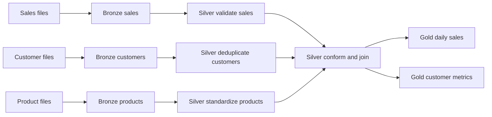
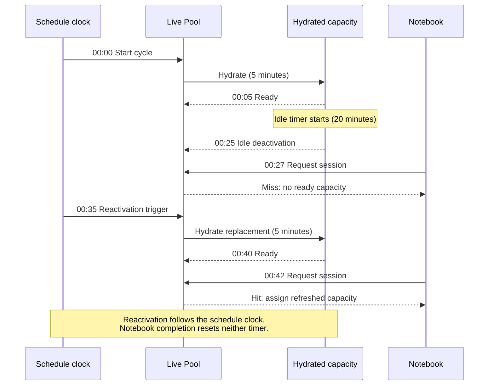
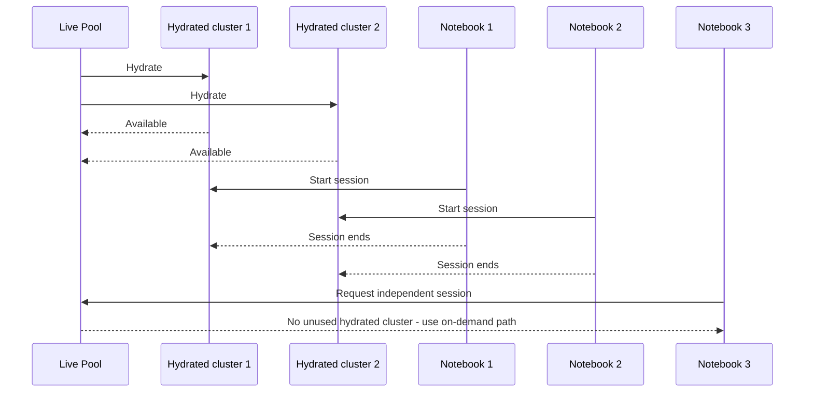
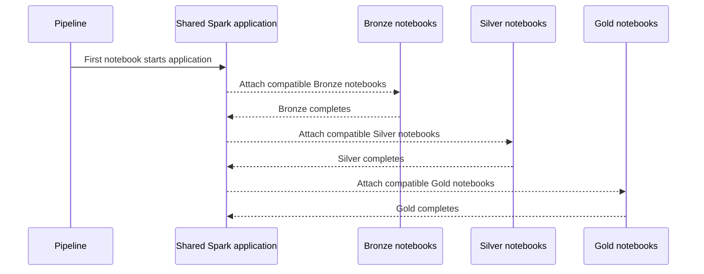
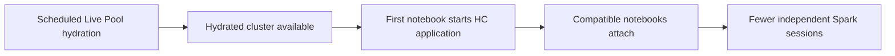

# Faster or cheaper? Choosing Custom Live Pools and High Concurrency for Microsoft Fabric medallion ETL pipelines

## Motivation: answering the Spark cost-performance question

Customers frequently ask me a deceptively simple question: **What is the most cost-effective Spark setup that still meets my pipeline performance target?**

It is a question I encounter often in my work at Microsoft, particularly when teams move production extract, transform, and load (ETL) processes into a medallion architecture on Microsoft Fabric. The answer is rarely "choose the biggest pool." For notebook-based pipelines, total duration and Capacity Unit (CU) consumption depend not only on how quickly transformations execute, but also on how many Spark sessions the pipeline creates, how long those sessions remain active, and whether compute is ready when the pipeline arrives.

Two Fabric capabilities address different parts of that problem:

- **Custom Live Pools** prepare clusters before a predictable workload window, reducing session provisioning latency.
- **High Concurrency** lets compatible notebooks share a running Spark application, reducing the number of independent sessions.

Used together, they can provide both a fast first session and fast attachment for subsequent notebook activities. But that does not mean enabling both is always the lowest-cost choice. A Live Pool can consume capacity while its clusters are hydrated, even when no notebook is executing, and too many notebooks sharing one session can compete for the same executors.

This article explains the mechanics, compares measured Bronze-Silver-Gold pipeline results, and provides a decision framework for choosing the right configuration.

## The scenario: a notebook-based medallion pipeline

Consider a daily retail pipeline that processes a fixed input snapshot through three layers:


```mermaid
flowchart LR
    S1[Sales files] --> B1[Bronze sales]
    S2[Customer files] --> B2[Bronze customers]
    S3[Product files] --> B3[Bronze products]

    B1 --> V1[Silver validate sales]
    B2 --> V2[Silver deduplicate customers]
    B3 --> V3[Silver standardize products]
    V1 --> J[Silver conform and join]
    V2 --> J
    V3 --> J

    J --> G1[Gold daily sales]
    J --> G2[Gold customer metrics]
```

The Fabric pipeline contains:

| Layer | Notebook activities | Pattern |
| --- | ---: | --- |
| Bronze | 3 | Parallel ingestion into Delta tables |
| Silver | 4 | Three parallel cleansing activities followed by a join |
| Gold | 2 | Parallel business aggregations |

All activities run under the same pipeline identity, in the same workspace, with the same Fabric environment, Spark compute settings, libraries, and default lakehouse. Those controls are important because High Concurrency sharing requires compatible sessions. This retail architecture illustrates the production problem; the benchmark below uses a simpler, three-notebook sequence to compare compute configurations.

The optimization target is not simply the fastest notebook. It is:

1. Meet the end-to-end pipeline service-level objective.
2. Minimize CU consumption required to meet it.
3. Keep startup behavior predictable during the production window.
4. Preserve enough isolation and executor capacity for transformations to run reliably.

## Custom Live Pools: prepare compute before the pipeline arrives

A Custom Live Pool is a set of prehydrated clusters associated with a custom Spark pool and a Fabric environment. During a configured schedule window, Fabric prepares the clusters, including the environment configuration, before a notebook requests a session. When a compatible hydrated cluster is available, a notebook session can start in approximately 5 to 10 seconds rather than waiting for standard on-demand provisioning. ([source][live-overview])

Custom Live Pools are most relevant when a Starter Pool cannot deliver its usual fast-start path and must provision compute. Typical examples include workspaces that use managed private endpoints (MPEs), published libraries, specific Spark properties in an environment, or other settings that require session personalization or dedicated provisioning.

When none of those requirements prevents use of the prewarmed Starter Pool, sessions can start within seconds. In that case, a Custom Live Pool provides no meaningful startup benefit over the Starter Pool. High Concurrency can still be useful: compatible notebooks can reuse the same application instead of starting independent sessions, even when the initial startup is already fast.

Custom Live Pools require a paid Fabric capacity, a custom Spark pool, a published environment, and workspace Admin permissions. Trial capacities are not supported. The benchmark uses REST APIs to configure activation schedules and monitor readiness; the companion [Custom Live Pools API how-to][live-api-howto] covers that workflow. ([overview][live-overview], [configuration guide][live-config])

The lifecycle has four useful concepts:

- **Schedule window:** The period during which Fabric can keep clusters hydrated and rehydrate deactivated capacity.
- **Hydration:** Provisioning the cluster and applying the published environment so that it is ready for a notebook.
- **Idle deactivation:** Removing an unused hydrated cluster after the configured idle timeout.
- **Reactivation:** Rehydrating capacity during the active schedule according to the configured interval.

Outside the schedule window, notebooks fall back to standard Spark provisioning and do not receive the Live Pool warm-start benefit. ([source][live-config])

### Why the environment publishing mode matters

For the most predictable startup, use a published environment with libraries in **Full mode**. The library snapshot is baked into the hydrated cluster. With **Quick mode**, libraries install when the session starts, so a Live Pool can remove cluster-acquisition time without removing library-installation time. ([source][live-overview])

### Availability is finite

The configured maximum cluster count is a hard ceiling; the Live Pool does not scale beyond it. If all compatible hydrated clusters are busy, additional notebooks use on-demand provisioning, which can take approximately 3 to 5 minutes or longer depending on library dependencies and the presence of Managed Private Endpoints. ([source][live-overview])

### Idle deactivation and reactivation use different timers

Idle deactivation and automatic reactivation are pool-level behaviors, not timers that restart when a notebook finishes. The idle timer applies to unused Live Pool capacity after hydration makes it ready. The reactivation timer follows its configured cadence from the schedule cycle and can prepare fresh capacity up to the pool maximum.

As a result, a notebook that arrives after idle deactivation but before reactivation finishes can still miss the Live Pool. A notebook that arrives after the new hydration completes can use the refreshed capacity. For example, if hydration takes five minutes, idle deactivation is 20 minutes, and reactivation is every 35 minutes, unused capacity can deactivate at approximately minute 25 and become available again only after the minute-35 reactivation has finished provisioning:


```mermaid
sequenceDiagram
    participant S as Schedule clock
    participant P as Live Pool
    participant C as Hydrated capacity
    participant N as Notebook

    S->>P: 00:00 Start cycle
    P->>C: Hydrate (5 minutes)
    C-->>P: 00:05 Ready
    Note over C: Idle timer starts (20 minutes)
    C-->>P: 00:25 Idle deactivation
    N->>P: 00:27 Request session
    P-->>N: Miss: no ready capacity
    S->>P: 00:35 Reactivation trigger
    P->>C: Hydrate replacement (5 minutes)
    C-->>P: 00:40 Ready
    N->>P: 00:42 Request session
    P-->>N: Hit: assign refreshed capacity
    Note over S,C: Reactivation follows the schedule clock.<br/>Notebook completion resets neither timer.
```

> **Configure the timers with a buffer.** Set the reactivation interval far enough beyond the idle deactivation point for expiry and deallocation to complete. If reactivation fires too close to that transition, its provisioning attempt can overlap with the expiring clusters and be deduplicated or cancelled. Account for hydration time because idle deactivation starts after capacity becomes ready, whereas reactivation follows the schedule-cycle clock.

### Clusters are not reusable within an hydration cycle

> A Live Pool hydrated cluster is single-use for one Spark session within a Live Pool schedule/reactivation cycle.

It means I would not size the pool only from the maximum number of simultaneously running notebooks. For independent, non-High-Concurrency sessions, I would also consider how many session starts are expected before the next successful reactivation.

For example, if a cycle begins with two available hydrated clusters and three independent sessions start sequentially, the first two can hit warm capacity while the third can take the on-demand path, even if the first session has already ended.


```mermaid
sequenceDiagram
    participant LP as Live Pool
    participant C1 as Hydrated cluster 1
    participant C2 as Hydrated cluster 2
    participant N1 as Notebook 1
    participant N2 as Notebook 2
    participant N3 as Notebook 3

    LP->>C1: Hydrate
    LP->>C2: Hydrate
    C1-->>LP: Available
    C2-->>LP: Available
    N1->>C1: Start session
    N2->>C2: Start session
    N1-->>C1: Session ends
    N2-->>C2: Session ends
    N3->>LP: Request independent session
    LP-->>N3: No unused hydrated cluster - use on-demand path
```

### The cost trade-off

Billing stops when the Spark session stops and its cluster is deallocated, or when idle deactivation removes an unused hydrated cluster. The schedule defines when Fabric can hydrate and reactivate Live Pool capacity; reaching the end of a schedule is not, by itself, the billing event to use when reasoning about an active session.

Under the standard **provisioned Fabric capacity** model, using a Custom Live Pool does not change the price of the purchased capacity. It changes when and how much of that capacity is consumed, which can affect headroom, smoothing, throttling, and the ability of other workloads to run. With **Autoscale Billing for Spark**, the consumed CU time has a direct billing impact, so idle and session lifetime become an explicit monetary consideration. ([source][spark-billing])

In either model, configure the custom pool carefully. A Live Pool cluster uses the node size and scaling boundaries configured in that pool. Enabling autoscale and choosing realistic minimum and maximum nodes can reduce CU consumption compared with keeping an oversized fixed cluster allocated.

A Live Pool is therefore most attractive when it avoids a real provisioning delay and the workload window is predictable enough to justify prehydration.

## High Concurrency: reuse a Spark application instead of creating one per notebook

In standard mode, each notebook activity creates its own Spark session. In High Concurrency mode, compatible notebook workloads share one Spark application. Fabric creates a separate read-eval-print loop (REPL) core for each workload, providing execution-state isolation, and uses FAIR scheduling across REPL cores to reduce starvation risk. ([source][hc-overview])

When you enable High Concurrency mode for pipelines, Fabric automatically packs compatible notebook activities into active High Concurrency sessions. Omitting a session tag does not opt out: compatible untagged activities can still be grouped on a best-effort basis. A shared session tag makes the intended grouping explicit, while different tags create separate grouping boundaries. ([source][hc-pipelines])

To share, activities must:

- Run within the same user or execution-identity boundary.
- Use the same workspace.
- Use the same default lakehouse configuration.
- Use matching Spark compute settings.
- Use the same environment library packages.

If a condition differs, Fabric creates another Spark session. ([source][hc-pipelines])

The default sharing limit is five notebooks per High Concurrency session. Current documentation also describes an environment property, `spark.highConcurrency.max`, that can raise the limit to 50 ([source][hc-overview]). Do not increase density only because the setting exists: validate executor contention, memory pressure, and failure isolation under representative load.

### What High Concurrency improves

The first activity still needs a Spark application. The benefit appears when later compatible activities attach to it:


```mermaid
sequenceDiagram
    participant P as Pipeline
    participant S as Shared Spark application
    participant B as Bronze notebooks
    participant V as Silver notebooks
    participant G as Gold notebooks

    P->>S: First notebook starts application
    S-->>B: Attach compatible Bronze notebooks
    B-->>S: Bronze completes
    S-->>V: Attach compatible Silver notebooks
    V-->>S: Silver completes
    S-->>G: Attach compatible Gold notebooks
    G-->>S: Gold completes
```

Fabric bills the initiating notebook or pipeline activity that starts the shared Spark application. Subsequent workloads sharing that application are not billed as separate sessions; Capacity Metrics attributes the shared-session usage to the initiating item. ([source][hc-overview])

This does **not** mean the attached notebooks consume no compute. It means their work runs inside, and is attributed to, the initiating shared application.

### Control the shared driver lifetime

For pipeline High Concurrency sessions, the Spark property `livy.rsc.repl.session.driver.idle.timeout` controls how long the shared driver remains alive without notebook activity. The default is two minutes.

That default can be too short when a non-Spark activity sits between notebooks. For example, if a stored procedure activity normally takes six minutes, the shared driver can expire before the next notebook arrives. Set the property only if you experience that the session is not being reused, and only to cover the expected gap with a reasonable buffer:

```text
livy.rsc.repl.session.driver.idle.timeout = 10m
```

A longer timeout improves the chance that later notebooks reuse the session, but it also keeps compute allocated longer. Tune it from the longest expected orchestration gap rather than setting an unnecessarily high value.

Compute can keep consuming CU after the last notebook finishes. Include that consumption when evaluating CU usage, and tune the idle timeout to balance reuse against keeping compute allocated after the final activity.

### What High Concurrency does not guarantee

High Concurrency reduces repeated session startup and can improve resource utilization. It does not guarantee that transformation code runs faster. Concurrent REPL cores share the application's executors, so CPU-heavy shuffles, memory-intensive joins, or simultaneous writes can increase contention.

Use session tags as an architecture boundary, not merely a packing mechanism. For the example pipeline, a reasonable starting point is:

| Session tag | Activities | Reason |
| --- | --- | --- |
| `retail-ingest` | Bronze notebooks | Similar I/O-heavy ingestion profile |
| `retail-curate` | Silver notebooks | Shared configuration, with resources sized for joins |
| `retail-serve` | Gold notebooks | Separate aggregation and publishing boundary |

One tag for the entire pipeline may minimize session creation, but separate tags can provide better resource and failure isolation. Benchmark both if the trade-off matters.

## How Custom Live Pools and High Concurrency work together

The two features optimize different lifecycle points:

| Capability | Primary optimization | Unit being reused or prepared |
| --- | --- | --- |
| Custom Live Pool | First-session acquisition | A prehydrated cluster |
| High Concurrency | Subsequent compatible session attachment | A running Spark application |

Together, the first notebook can acquire a prehydrated cluster, create a High Concurrency Spark application, and allow later compatible notebooks to attach to that application:


```mermaid
flowchart LR
    A[Scheduled Live Pool hydration] --> B[Hydrated cluster available]
    B --> C[First notebook starts HC application]
    C --> D[Compatible notebooks attach]
    D --> E[Fewer independent Spark sessions]
```

This interaction can be particularly valuable in medallion pipelines with many short notebook activities. Without High Concurrency, each activity can consume another hydrated cluster or fall back to on-demand provisioning. With High Concurrency, multiple activities can be served by one shared application, reducing pressure on the Live Pool cluster count.

However, the combination has two independent consumption levers:

- How long and how many Live Pool clusters remain allocated.
- How large and how long the shared Spark applications remain active.

Optimize both. Under provisioned capacity, this protects capacity headroom; under Autoscale Billing, it also reduces billed Spark consumption.

## Benchmark: one pipeline, six compute configurations

The benchmark represents one ETL pipeline with three consecutive notebook activities:

```text
Bronze notebook -> Silver notebook -> Gold notebook
```

Each notebook simulates the work of its medallion stage by running a different selection of TPC-DS SF100 queries with [LakeBench][lakebench]. The labels describe the notebooks' roles in the pipeline; the benchmark does not attempt to reproduce every transformation found in a production Bronze, Silver, or Gold layer.

The comparison answers two immediate questions: how long does the pipeline take, and how much observed CU consumption accompanies it? The more reusable insight, however, is **why the configurations differ**. Startup path, application reuse, prepared capacity, and the time spent at each cluster size can matter as much as the transformations themselves.

**The benchmark workspace has managed private endpoints.** As a result, selecting a Starter Pool in SP/SP-HC falls back to on-demand provisioning rather than using its usual prewarmed, seconds-fast startup path. The purpose of this exercise is to evaluate the impact of Custom Live Pools when that fast Starter Pool path is unavailable; these startup measurements should not be generalized to workspaces where Starter Pools can use it.

For individual-run results, notebook timing, cluster allocation, and instructions for repeating the test, see the [benchmark details and replication resource][benchmark-details].

### Configurations compared

| Scenario | Compute path | How the three notebooks run |
| --- | --- | --- |
| SP | Starter Pool (on-demand fallback) | Three isolated Spark applications |
| OD | On-demand custom pool | Three isolated Spark applications |
| CLP | Custom Live Pool | Three isolated Spark applications |
| SP-HC | Starter Pool (on-demand fallback) | One shared High Concurrency application |
| OD-HC | On-demand custom pool | One shared High Concurrency application |
| CLP-HC | Custom Live Pool | One shared High Concurrency application |

The tests ran on an F32 capacity with the same input snapshot, pinned library versions, and 85 ordered queries: 29 in Bronze, 28 in Silver, and 28 in Gold. Each notebook finished when its actual work finished, without execution-time padding or CU normalization. Native Execution Engine and Remote Shuffle Manager were enabled, with efficient scaledown in the attached environments.

High Concurrency for pipelines was disabled for SP/OD/CLP and enabled for SP-HC/OD-HC/CLP-HC. CLP used a Live Pool environment with up to three hydrated clusters, while CLP-HC used one for its shared application. Both Live Pool pipelines were submitted three minutes after the activation first reported at least one ready cluster. SP/SP-HC had no attached environment, but the workspace's private connectivity still required on-demand provisioning. Runs were executed serially to avoid shared-capacity interference and conflicting workspace settings.

### Results

The table reports means from **three selected runs per scenario**, using the same physical runs for latency and CU. Notebook CU is the consumption of the complete three-notebook run: three distinct sessions for SP/OD/CLP, or one shared session counted once for SP-HC/OD-HC/CLP-HC. It includes CU used while Spark sessions remain active, not just query execution.

| Scenario | Mean pipeline latency (s) | Three-run latency range (s) | Notebook CU-s | Environment CU-s | Observed notebook + environment CU-s |
| --- | ---: | ---: | ---: | ---: | ---: |
| SP | 1,166.0 | 1,128.7-1,186.5 | 7,542.1 | N/A | **7,542.1** |
| OD | 1,256.9 | 1,214.3-1,280.7 | 8,085.4 | N/A | **8,085.4** |
| CLP | 844.2 | 821.5-878.6 | 8,669.3 | 678.9 | **9,348.2** |
| SP-HC | 744.3 | 711.3-783.9 | 7,528.7 | N/A | **7,528.7** |
| OD-HC | 731.7 | 723.1-736.2 | 7,819.7 | N/A | **7,819.7** |
| CLP-HC | 571.9 | 554.4-591.2 | 7,222.0 | 227.2 | **7,449.1** |

These are **observed consumption figures, not proven complete lifecycle costs**. SP/SP-HC have no attached environment; OD/OD-HC have no separately observed environment events, so their subtotal is notebook-only. CLP/CLP-HC include reported CLP activation consumption. Pipeline orchestration consumed a separate 60.48 CU-s per run and is excluded from the table. Figures are rounded for presentation.

For guidance on how notebook, CLP environment, and pipeline CU were measured in this benchmark, and how to repeat the analysis in your own workspace, see [v0003: Measure Fabric CU usage with Capacity Operation Events][cu-monitoring].

### Understanding notebook CU differences

The notebook CU differences within **SP/OD/CLP**, and likewise within **SP-HC/OD-HC/CLP-HC**, are consistent with the variation expected from autoscaling. Clusters scaled up at different times, so identical query selections spent different amounts of time at a larger allocated footprint. These differences should not be read as an intrinsic CU surcharge for a particular pool type, or as proof of statistical equivalence from this small sample.

High Concurrency changes that allocation pattern. Instead of starting each stage in a new, initially smaller application, the shared cluster retained an expanded footprint between notebooks as it was reused. Its average billed cluster size was consequently greater than in the isolated-session scenarios. Avoiding repeated startup can make the pipeline much faster without reducing notebook CU in the same proportion.

The **CU used after the last notebook finishes also matters**. In the selected HC runs, approximate consumption after the final notebook completed represented about 15-18% of observed notebook CU. That consumption is already included in the table, not an extra charge to add again. Evaluate extending session lifetime very carefully alongside notebook execution and orchestration gaps.

Configuring a fixed-size cluster could make notebook CU consumption more similar by removing scale-up timing differences, although execution duration and session lifetime would still affect the result. I deliberately retained autoscaling to reflect a scenario closer to real-world operation rather than forcing identical allocation curves. Library-only consumption was not isolated, so these results do not establish a fixed Starter Pool library-installation surcharge.

### Understanding latency and the overall trade-off

**CLP-HC had the lowest mean pipeline latency in this sample:** a prepared first cluster followed by reuse of the same High Concurrency application. CLP also avoided cold acquisition, but each notebook needed its own application. SP-HC and OD-HC avoided repeated application startup after the first notebook; their selected latency ranges overlap, so the small difference in their means is not a general ranking of the two pool types.

SP and OD paid for three independent application starts and had the longest mean pipeline times. The overall pattern is more useful than a universal "cheapest configuration" claim: Live Pools reduce the wait for prepared compute, while High Concurrency reduces repeated startup. Their CU trade-off depends on allocation over time, compute kept running after notebooks finish, and the additional consumption required to prepare Live Pool capacity.

### Practical guidance

- Choose **On-demand custom pool with High Concurrency (OD-HC)** when notebooks are compatible with sharing and the pipeline can tolerate a cold first session. It avoids repeated application startup without scheduling Live Pool hydration, but include the retained cluster footprint and CU used after the last notebook finishes in the assessment.
- Choose **Custom Live Pool with High Concurrency (CLP-HC)** when the pipeline has a tight completion target and a predictable schedule. Hydrate enough capacity for the first shared application, then let compatible downstream notebooks attach to it. Include Live Pool Environment CU when evaluating the improvement.
- Choose **Custom Live Pool with isolated applications (CLP)** when notebooks need separate applications but startup must still be predictable. Size the Live Pool for the number of session starts in each hydration cycle, not only the peak number of concurrent notebooks.
- A **Starter Pool** can remain the simplest choice when private connectivity, published libraries, or specific environment Spark properties do not prevent its prewarmed startup path. If sessions already start within seconds, CLP offers no meaningful startup advantage. High Concurrency still has value for compatible activities that benefit from application reuse. The benchmark's SP/SP-HC results instead reflect the on-demand fallback required by managed private endpoints.
- Tune the complete lifecycle: align the Live Pool schedule with pipeline arrival, leave enough space between idle deactivation and reactivation, and set the High Concurrency driver timeout to cover normal gaps between Bronze, Silver, and Gold without keeping compute alive unnecessarily.
- Run your specific scenario and evaluate the cost of your specific tradeoffs. Measure application acquisition, attachment time, Environment CU, active cluster size, and end-to-end latency separately so an improvement in one component does not hide a regression in another.

## What to watch next

Future work on returning clusters to a Custom Live Pool after a session ends could change these recommendations. Reusing returned clusters could reduce the maximum cluster count needed to serve successive independent sessions, shifting sizing decisions toward peak concurrent demand rather than total session starts within a hydration cycle. It could also change the relative benefit of High Concurrency: HC would still reuse a running application, but avoiding repeated cluster provisioning might become less of a differentiator. Revisit pool sizing and the latency/CU trade-off when that behavior becomes available; the results here reflect the current single-use-per-cycle behavior.

## References

- [v0003: Measure Fabric CU usage with Capacity Operation Events][cu-monitoring], for the measurement method and reusable KQL.
- Microsoft Learn, [Custom live pools for Fabric Data Engineering overview][live-overview].
- Microsoft Learn, [Configure custom live pools in Microsoft Fabric][live-config].
- Microsoft Learn, [High concurrency mode in Apache Spark compute for Fabric][hc-overview].
- Microsoft Learn, [Configure high concurrency mode for notebooks in pipelines][hc-pipelines].
- Microsoft Learn, [Apache Spark billing and utilization in Microsoft Fabric][spark-billing].
- Microsoft Learn, [Monitor Apache Spark capacity consumption][spark-monitor].
- Microsoft Learn, [Concurrency limits and queueing in Apache Spark for Fabric][spark-concurrency].

[live-overview]: https://learn.microsoft.com/en-us/fabric/data-engineering/custom-live-pools-overview
[live-config]: https://learn.microsoft.com/en-us/fabric/data-engineering/custom-live-pools-configure
[live-api-howto]: ../manage-custom-live-pools-through-apis/
[benchmark-details]: ../../resources/custom-live-pools-benchmark/
[cu-monitoring]: ../monitor-cu-usage-capacity-operation-events/
[lakebench]: https://github.com/microsoft/LakeBench
[hc-overview]: https://learn.microsoft.com/en-us/fabric/data-engineering/high-concurrency-overview
[hc-pipelines]: https://learn.microsoft.com/en-us/fabric/data-engineering/configure-high-concurrency-session-notebooks-in-pipelines
[spark-billing]: https://learn.microsoft.com/en-us/fabric/data-engineering/billing-capacity-management-for-spark
[spark-monitor]: https://learn.microsoft.com/en-us/fabric/data-engineering/monitor-spark-capacity-consumption
[spark-concurrency]: https://learn.microsoft.com/en-us/fabric/data-engineering/spark-job-concurrency-and-queueing
